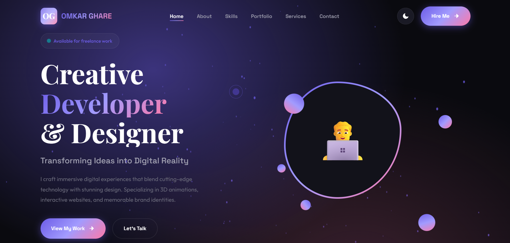

# 🌐 Personal Portfolio Website Template — V6

A modern and fully responsive personal portfolio website template designed for developers, designers, freelancers, and creative professionals.

This project focuses on clean UI/UX, smooth animations, elegant layouts, and professional presentation to create a strong online presence.

---

## 🚀 Features

- Fully Responsive Design
- Smooth Scrolling Navigation
- Modern Hero Section
- About & Skills Section
- Projects Showcase
- Animated UI Elements
- Contact Form UI
- Clean & Organized Code
- Mobile-Friendly Layout
- Fast & Lightweight Design

---

## 🛠️ Technologies Used

- HTML5
- CSS3
- JavaScript
- Responsive Design
- CSS Animations

---

## 📸 Preview

---

## 💡 Purpose Of This Project

This template was created to help developers and creators build a professional online portfolio with a premium modern design.

---

## 👨‍💻 Author

Designed & Developed By **Omkar R. Ghare**

---

## 📜 License

This project is open-source and free to use for learning and personal projects.
